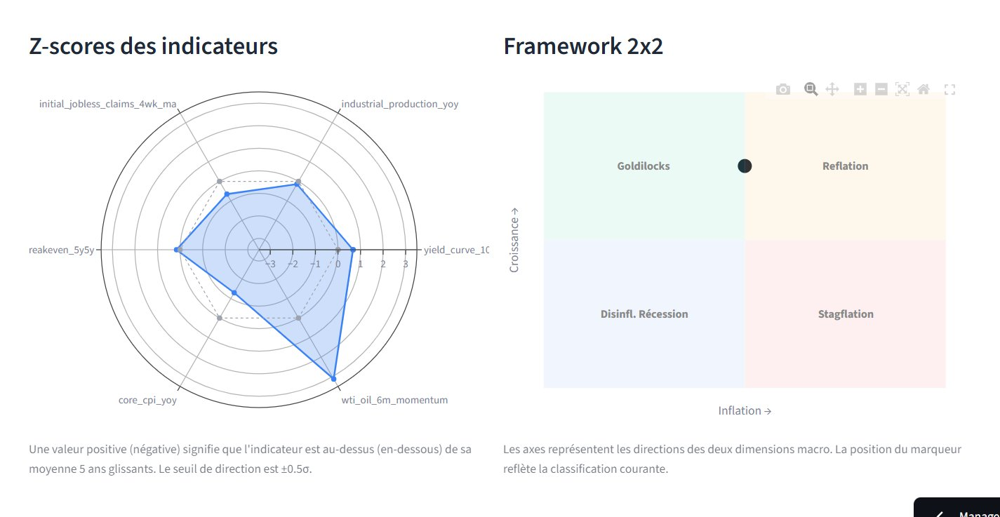

# Bordeaux Multi-Asset Lab

> Système systématique d''allocation tactique multi-actifs guidé par le régime macroéconomique

[](https://github.com/TTB10/bordeaux-multi-asset-lab/actions/workflows/ci.yml)
[](https://www.python.org/downloads/)
[](https://github.com/astral-sh/ruff)
[](LICENSE)
[](https://ttb10-bml.streamlit.app)

**[Accéder au dashboard live](https://ttb10-bml.streamlit.app)** · **[White paper](docs/white_paper.md)** · **[Documentation technique](docs/technical_doc.md)**



---

## Le problème

L''allocation d''actifs détermine 80 à 90 % de la performance d''un portefeuille à long terme ([Brinson, Hood & Beebower, 1986](https://www.cfainstitute.org/en/research/financial-analysts-journal/1986/determinants-of-portfolio-performance)). Pourtant, l''allocation tactique systématique reste largement inaccessible au gérant indépendant ou à l''investisseur particulier sophistiqué : robo-advisors statiques, mandats discrétionnaires opaques, ou fonds quanti institutionnels hors de portée.

## L''approche

Bordeaux Multi-Asset Lab propose un framework systématique transparent qui :

- **Détecte le régime macroéconomique courant** parmi 5 états (Goldilocks, Reflation, Stagflation, Récession désinflationniste, Incertain) à partir de 6 indicateurs publics extraits de la base FRED
- **Dérive une allocation cible** modérément tiltée par rapport à un benchmark 60/40 enrichi multi-actifs
- **Régularise par confidence** : aucun pari extrême sur un signal faible. L''allocation finale ne s''écarte de la référence neutre que dans la mesure où le signal est statistiquement crédible
- **Sélectionne les fonds concrets** dans un univers de 49 ETFs UCITS via un scoring composite Sharpe / drawdown / frais

Toutes les données utilisées sont publiques. Tout le code est open-source. Chaque décision d''allocation peut être tracée jusqu''aux indicateurs macroéconomiques sous-jacents.

## Quick start

Prérequis : Python 3.12+, [uv](https://docs.astral.sh/uv/), une [clé API FRED gratuite](https://fred.stlouisfed.org/docs/api/api_key.html).

```bash
# Cloner et installer
git clone https://github.com/TTB10/bordeaux-multi-asset-lab.git
cd bordeaux-multi-asset-lab
uv sync --all-extras

# Configurer la clé FRED
echo "FRED_API_KEY=your_key_here" > .env

# Vérifier l''installation
uv run pytest

# Lancer le dashboard
uv run streamlit run app/streamlit_app.py
```

Le dashboard sera accessible sur `http://localhost:8501`.

## Architecture

Sept modules indépendants avec pattern Stratégie. Le pipeline exécute ces modules en séquence linéaire :
| Module | Responsabilité |
|---|---|
| `data` | Acquisition des prix Yahoo et séries FRED, avec retry-and-backoff |
| `universe` | Chargement de l''univers d''investissement depuis configuration YAML |
| `regime` | 6 indicateurs -> classification parmi 5 régimes + confidence |
| `allocation` | Mapping régime -> allocation cible, avec smoothing par confidence |
| `selection` | Sélection top-N par classe d''actifs via scoring composite |
| `portfolio` | État temporel du portefeuille avec persistance JSON |
| `risk` | 7 métriques empiriques + comparaison benchmark |

Pour les détails, voir la [documentation technique](docs/technical_doc.md).

## Qualité du code

- **161 tests unitaires** passants, **couverture 90 %**
- **mypy strict mode** sur l''ensemble du code source
- **ruff** linting + formatting automatique
- **GitHub Actions CI** sur chaque push

## Documentation

- **[White paper](docs/white_paper.md)** — Méthodologie complète, revue de littérature, résultats empiriques (~30 pages)
- **[Documentation technique](docs/technical_doc.md)** — Référence du code, classes, exemples d''usage (~50 pages)
- **[Dashboard live](https://ttb10-bml.streamlit.app)** — Accès interactif au framework, mis à jour automatiquement

## Discipline de publication

À partir du 5 juillet 2026, une lettre d''investissement mensuelle est publiée le 5 de chaque mois, présentant le régime détecté, l''allocation cible, le portefeuille concret avec ses transactions de rebalancement, et la performance écoulée. Cette régularité construit un track record vérifiable et impose une discipline de revue continue du framework.

## Roadmap

**V1.1 (juin 2026)** — Polish UX, lettre mensuelle automatisée, corrections cosmétiques mineures.

**V2 (T3 2026)** — Backtest pluriannuel point-in-time sur 15-20 ans, modélisation des coûts de transaction, élargissement géographique des indicateurs (ECB, Chine).

**V3 (T4 2026)** — Hidden Markov Models pour la détection de régime, overlay de tail risk hedging.

## Limites assumées

- **Validation préliminaire** : la fenêtre actuelle de 3 ans glissants est insuffisante pour valider statistiquement la valeur ajoutée du timing macro. Backtest pluriannuel en cours de développement.
- **Indicateurs US uniquement** : pas d''indicateurs ECB, asiatiques ou émergents. Limite documentée dans le white paper.
- **Pas de coûts de transaction modélisés** en V1. À intégrer en V2.
- **Pas de gestion fiscale** différenciée selon enveloppe (PEA, AV, CTO).

Voir la section 6.2 du white paper pour la liste exhaustive.

## Auteur

**TTB10** — étudiant M1 IREF, Université de Bordeaux.

Ce projet a été développé dans le cadre d''une démarche de candidature à un stage M2 en gestion d''actifs systématique multi-stratégies.

## Licence

MIT — voir [LICENSE](LICENSE)

## Citation

Si vous utilisez ce framework ou vous en inspirez, merci de citer :